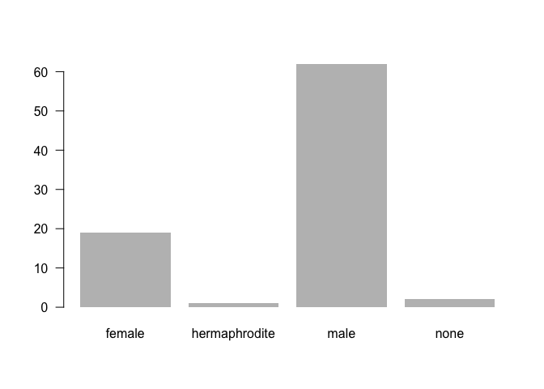

Pipes with dplyr
================
Gaston Sanchez

> ### Learning Objectives:
>
> -   Compare base R and `"dplyr"`
> -   Get to know the pipe operator `%>%`

------------------------------------------------------------------------

Introduction
------------

Last week you started to manipulate data tables (e.g. `data.frame`, `tibble`) with functions provided by the R package `"dplyr"`.

Having been exposed to the *dplyr* paradigm, let's compare R base manipulation against the various dplyr syntax flavors.

### Starwars Data Set

In this tutorial we are going to use the data set `starwars` that comes in `"dplyr"`:

``` r
# load dplyr
library(dplyr)

# data set
starwars
```

    ## # A tibble: 87 x 13
    ##    name     height  mass hair_color skin_color eye_color birth_year gender
    ##    <chr>     <int> <dbl> <chr>      <chr>      <chr>          <dbl> <chr> 
    ##  1 Luke Sk…    172  77.0 blond      fair       blue            19.0 male  
    ##  2 C-3PO       167  75.0 <NA>       gold       yellow         112   <NA>  
    ##  3 R2-D2        96  32.0 <NA>       white, bl… red             33.0 <NA>  
    ##  4 Darth V…    202 136   none       white      yellow          41.9 male  
    ##  5 Leia Or…    150  49.0 brown      light      brown           19.0 female
    ##  6 Owen La…    178 120   brown, gr… light      blue            52.0 male  
    ##  7 Beru Wh…    165  75.0 brown      light      blue            47.0 female
    ##  8 R5-D4        97  32.0 <NA>       white, red red             NA   <NA>  
    ##  9 Biggs D…    183  84.0 black      light      brown           24.0 male  
    ## 10 Obi-Wan…    182  77.0 auburn, w… fair       blue-gray       57.0 male  
    ## # ... with 77 more rows, and 5 more variables: homeworld <chr>,
    ## #   species <chr>, films <list>, vehicles <list>, starships <list>

### Average Height of Male and Female Individuals

For illustration purposes, let's consider a relatively simple example. Say we are interested in calculating the average (mean) height for both female and male individuals. Let's discuss how to find the solution under the base R approach, as well as the dplyr approach.

------------------------------------------------------------------------

Quick inspection of `height`
----------------------------

``` r
# summary stats of height
summary(starwars$height)
```

    ##    Min. 1st Qu.  Median    Mean 3rd Qu.    Max.    NA's 
    ##    66.0   167.0   180.0   174.4   191.0   264.0       6

``` r
# histogram
hist(starwars$height, col = 'gray80', las = 1)
```


### Quick inspection of `gender`

``` r
# frequencies of gender
summary(starwars$gender)
```

    ##    Length     Class      Mode 
    ##        87 character character

``` r
gender_freqs <- table(starwars$gender)
gender_freqs
```

    ## 
    ##        female hermaphrodite          male          none 
    ##            19             1            62             2

``` r
# barchart of gender freqs
barplot(gender_freqs, border = NA, las = 1)
```



Now let's use `"dplyr"` to get the frequencies:

``` r
# distinct values 
distinct(starwars, gender)
```

    ## # A tibble: 5 x 1
    ##   gender       
    ##   <chr>        
    ## 1 male         
    ## 2 <NA>         
    ## 3 female       
    ## 4 hermaphrodite
    ## 5 none

Oh! Notice that we have some missing values, which were not reported by `table()`.

``` r
# frequencies of gender (via dplyr) 
count(starwars, gender)
```

    ## # A tibble: 5 x 2
    ##   gender            n
    ##   <chr>         <int>
    ## 1 female           19
    ## 2 hermaphrodite     1
    ## 3 male             62
    ## 4 none              2
    ## 5 <NA>              3

------------------------------------------------------------------------

Base R approach
---------------

Let's see how to use base R operations to find the average `height` of individuals with `gender` female and male.

``` r
# identify female and male individuals
# (comparison operations)
which_females <- starwars$gender == 'female'
which_males <- starwars$gender == 'male'
```

``` r
# select the height values of females and males
# (via logical subsetting)
height_females <- starwars$height[which_females]
height_males <- starwars$height[which_males]
```

``` r
# calculate averages (removing missing values)
avg_ht_female <- mean(height_females, na.rm = TRUE)
avg_ht_male <- mean(height_males, na.rm = TRUE)

# optional: display averages in a vector
c('female' = avg_ht_female, 'male' = avg_ht_male)
```

    ##   female     male 
    ## 165.4706 179.2373

All the previous code can be written with more compact expressions:

``` r
# all calculations in a couple of lines of code
c("female" = mean(starwars$height[starwars$gender == 'female'], na.rm = TRUE),
  "male" = mean(starwars$height[starwars$gender == 'male'], na.rm = TRUE)
)
```

    ##   female     male 
    ## 165.4706 179.2373

------------------------------------------------------------------------

With `"dplyr"`
--------------

The behavior of `"dplyr"` is functional in the sense that function calls don't have side-effects. You must always save their results in order to keep them in an object (in memory). This doesn't lead to particularly elegant code, especially if you want to do many operations at once.

### Option 1) Step-by-step

You either have to do it step-by-step:

``` r
# manipulation step-by-step
gender_height <- select(starwars, gender, height)

fem_male_height <- filter(gender_height, 
                          gender == 'female' | gender == 'male')

height_by_gender <- group_by(fem_male_height, gender)

summarise(height_by_gender, mean(height, na.rm = TRUE))
```

    ## # A tibble: 2 x 2
    ##   gender `mean(height, na.rm = TRUE)`
    ##   <chr>                         <dbl>
    ## 1 female                          165
    ## 2 male                            179

### Option 2) Nested (embedded) code

Or if you don't want to name the intermediate results, you need to wrap the function calls inside each other:

``` r
summarise(
  group_by(
    filter(select(starwars, gender, height),
           gender == 'female' | gender  == 'male'),
    gender),
  mean(height, na.rm = TRUE)
)
```

    ## # A tibble: 2 x 2
    ##   gender `mean(height, na.rm = TRUE)`
    ##   <chr>                         <dbl>
    ## 1 female                          165
    ## 2 male                            179

This is difficult to read because the order of the operations is from inside to out. Thus, the arguments are a long way away from the function.

### Option 3) Piping

To get around the problem of nesting functions, `"dplyr"` also provides the `%>%` operator from the R package `"magrittr"`.

What does the *piper* `%>%` do? Here's a conceptual example:

``` r
x %>% f(y)
```

`x %>% f(y)` turns into `f(x, y)` so you can use it to rewrite multiple operations that you can read left-to-right, top-to-bottom.

Here's how to use the piper to calculate the average height for female and male individuals:

``` r
avg_height_by_gender <- starwars %>% 
  select(gender, height) %>%
  filter(gender == 'female' | gender == 'male') %>%
  group_by(gender) %>%
  summarise(avg = mean(height, na.rm = TRUE))

avg_height_by_gender
```

    ## # A tibble: 2 x 2
    ##   gender   avg
    ##   <chr>  <dbl>
    ## 1 female   165
    ## 2 male     179

``` r
avg_height_by_gender$avg
```

    ## [1] 165.4706 179.2373

------------------------------------------------------------------------

Another Example
---------------

Here's another example in which we calculate the mean `height` and mean `mass` of `species` Droid, Ewok, and Human; arranging the rows of the tibble by mean height, in descending order:

``` r
starwars %>%
  select(species, height, mass) %>%
  filter(species %in% c('Droid', 'Ewok', 'Human')) %>%
  group_by(species) %>%
  summarise(
    mean_height = mean(height, na.rm = TRUE),
    mean_mass = mean(mass, na.rm = TRUE)
  ) %>%
  arrange(desc(mean_height))
```

    ## # A tibble: 3 x 3
    ##   species mean_height mean_mass
    ##   <chr>         <dbl>     <dbl>
    ## 1 Human         177        82.8
    ## 2 Droid         140        69.8
    ## 3 Ewok           88.0      20.0
