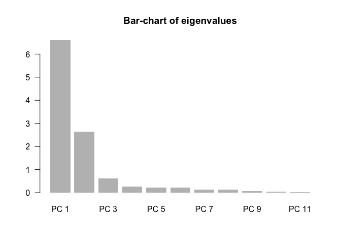
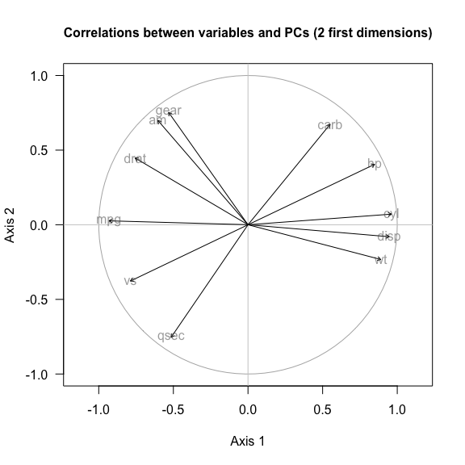
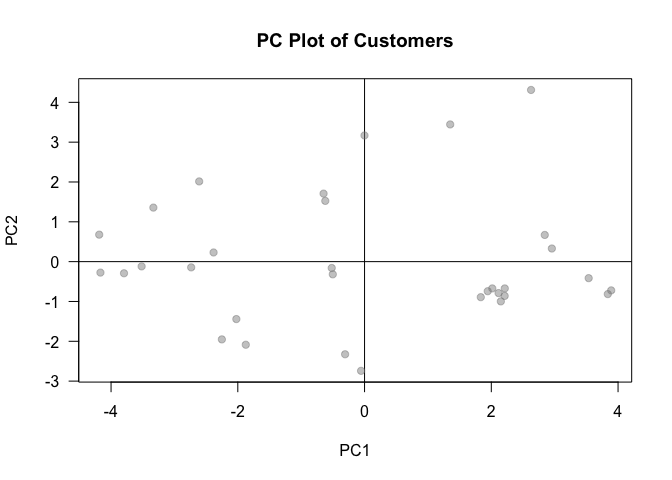

Intro to Principal Components Analysis (PCA)
================
Gaston Sanchez

Introduction
============

The goal of this tutorial is to go over the various options and steps required to perform a Principal Components Analysis (PCA). You will also learn about the functions `prcomp()` and `princomp()`, and how to use their outputs to answer questions like:

-   How many principal components to retain.
-   How to visualize the observations.
-   How to visualize the relationships among variables.

Dataset `mtcars`
----------------

In this tutorial we are going to use data about *Motor Trend Car Road Tests* containing fuel consumption and 10 aspects of automobile design and performance for 32 automobiles (1973–74 models).

The corresponding data set comes in R as a built-in data frame called `mtcars`. This object has 32 observations on 11 variables:

-   `mpg` Miles/(US) gallon
-   `cyl` Number of cylinders
-   `disp` Displacement (cu.in.)
-   `hp` Gross horsepower
-   `drat` Rear axle ratio
-   `wt` Weight (1000 lbs)
-   `qsec` 1/4 mile time
-   `vs` V/S
-   `am` Transmission (0 = automatic, 1 = manual)
-   `gear` Number of forward gears
-   `carb` Number of carburetors

The first 5 rows of the data set look like:

``` r
head(mtcars)
```

    ##                    mpg cyl disp  hp drat    wt  qsec vs am gear carb
    ## Mazda RX4         21.0   6  160 110 3.90 2.620 16.46  0  1    4    4
    ## Mazda RX4 Wag     21.0   6  160 110 3.90 2.875 17.02  0  1    4    4
    ## Datsun 710        22.8   4  108  93 3.85 2.320 18.61  1  1    4    1
    ## Hornet 4 Drive    21.4   6  258 110 3.08 3.215 19.44  1  0    3    1
    ## Hornet Sportabout 18.7   8  360 175 3.15 3.440 17.02  0  0    3    2
    ## Valiant           18.1   6  225 105 2.76 3.460 20.22  1  0    3    1

About PCA
---------

Principal Components Analysis is one of those jack of all trades methods whose behavior accepts different yet equivalent interpretations. We can use PCA to reduce the dimensionality of a data set (i.e. reduce the number of variables) while retaining as much as possible of the variation present in it. Likewise, we can use PCA for data visualization and exploration purposes using its outputs to obtain a map to visualize the objects in terms of their proximities, and another map to visualize the variables in terms of their correlations.

Overall, PCA helps us to summarize the systematic patterns of variation within observations, within variables, and between observations and variables. In summary, PCA allows us to:

-   to **"best summarize"** the important information contained in a data table.
-   to find a **"graphical representation"** of the essential information contained within a data set.
-   to find an **"optimal approximation"** of a data set with a minimal loss of information.

PCA Idea
--------

We look to transform the original variables into a smaller set of new variables, the Principal Components (PCs), that **summarize the variation in data**. The PCs are obtained as linear combinations (i.e. weighted sums) of the original variables. We look for PCs is in such a way that they have maximum variance, and being mutually uncorrelated.

R Functions for PCA
-------------------

R provides two built-in functions to perform Principal Components Analysis:

1.  `prcomp()`
2.  `princomp()`

Both functions are part of the `"stats"` package which comes in the default distribution of R. In addition to `prcomp()` and `princomp()`, there are various packages (e.g. `"FactoMineR"`, `"ade4"`, etc.) that provide other functions for PCA.

PCA with `prcomp()`
===================

The main input of `prcomp()` is a data frame or a data matrix. In order to perform PCA on standardized data (mean = 0, variance = 1), we use the argument `scale. = TRUE`.

Let's apply `prcomp()` on the quantitative variables---these are the *active* variables. We'll use the categorical variables as *supplementary* variables. Although all the quantitative variables are supposedly measured on the same scale (monetary units), it is usually preferable to standardize the data so that no single variable dominates the output because of the magnitude of its variability.

``` r
# PCA with prcomp()
pca_prcomp <- prcomp(mtcars, scale. = TRUE)

# what's in a prcomp object?
names(pca_prcomp)
```

    ## [1] "sdev"     "rotation" "center"   "scale"    "x"

The object `pca_prcomp` is an object of class `"prcomp"`, basically a list that contains the following results:

-   `sdev` corresponds to the standard deviations of the principal components.
-   `rotation` is the rotation matrix or loadings
-   `center` is the vector of means of the raw data.
-   `scale` is the vector of standard deviations of the raw data.
-   `x` is the matrix of principal components.

As we saw in lecture, the minimal output of a PCA procedure should consists of eigenvalues, loadings, and principal components:

The eigenvalues are the squared `sdev`:

``` r
# eigenvalues
eigenvalues <- pca_prcomp$sdev^2
eigenvalues
```

    ##  [1] 6.60840025 2.65046789 0.62719727 0.26959744 0.22345110 0.21159612
    ##  [7] 0.13526199 0.12290143 0.07704665 0.05203544 0.02204441

The reason why these are called `sdev` has to do with the variance of each principal component. The elements in `sdev` are simply the standard deviations of the PCs:

The loadings or PC weights are in `rotation`:

``` r
# loadings or weights
loadings <- pca_prcomp$rotation 
round(loadings, 3)
```

    ##         PC1    PC2    PC3    PC4    PC5    PC6    PC7    PC8    PC9   PC10
    ## mpg  -0.363  0.016 -0.226 -0.023  0.103 -0.109  0.368 -0.754  0.236  0.139
    ## cyl   0.374  0.044 -0.175 -0.003  0.058  0.169  0.057 -0.231  0.054 -0.846
    ## disp  0.368 -0.049 -0.061  0.257  0.394 -0.336  0.214  0.001  0.198  0.049
    ## hp    0.330  0.249  0.140 -0.068  0.540  0.071 -0.001 -0.222 -0.576  0.248
    ## drat -0.294  0.275  0.161  0.855  0.077  0.244  0.021  0.032 -0.047 -0.101
    ## wt    0.346 -0.143  0.342  0.246 -0.075 -0.465 -0.021 -0.009  0.359  0.094
    ## qsec -0.200 -0.463  0.403  0.068 -0.165 -0.330  0.050 -0.232 -0.528 -0.271
    ## vs   -0.307 -0.232  0.429 -0.215  0.600  0.194 -0.266  0.026  0.359 -0.159
    ## am   -0.235  0.429 -0.206 -0.030  0.090 -0.571 -0.587 -0.060 -0.047 -0.178
    ## gear -0.207  0.462  0.290 -0.265  0.048 -0.244  0.605  0.336 -0.002 -0.214
    ## carb  0.214  0.414  0.529 -0.127 -0.361  0.184 -0.175 -0.396  0.171  0.072
    ##        PC11
    ## mpg  -0.125
    ## cyl  -0.141
    ## disp  0.661
    ## hp   -0.256
    ## drat -0.040
    ## wt   -0.567
    ## qsec  0.181
    ## vs    0.008
    ## am    0.030
    ## gear -0.054
    ## carb  0.320

And the principal components, aka scores, are in the object `x`:

``` r
# scores or principal components
scores <- pca_prcomp$x
round(head(scores, 5), 3)
```

    ##                      PC1    PC2    PC3    PC4    PC5    PC6    PC7    PC8
    ## Mazda RX4         -0.647  1.708 -0.592  0.114 -0.946 -0.017 -0.426 -0.010
    ## Mazda RX4 Wag     -0.619  1.526 -0.376  0.199 -1.017 -0.242 -0.416 -0.085
    ## Datsun 710        -2.736 -0.144 -0.237 -0.245  0.399 -0.349 -0.609  0.585
    ## Hornet 4 Drive    -0.307 -2.326 -0.134 -0.504  0.549  0.019 -0.040 -0.050
    ## Hornet Sportabout  1.943 -0.743 -1.117  0.074  0.208  0.149  0.384 -0.160
    ##                      PC9   PC10   PC11
    ## Mazda RX4          0.146 -0.067  0.180
    ## Mazda RX4 Wag      0.075 -0.127  0.089
    ## Datsun 710        -0.131  0.046 -0.095
    ## Hornet 4 Drive     0.220 -0.060  0.148
    ## Hornet Sportabout -0.021 -0.060  0.146

Before discussing what to do with the output of a PCA, let's quickly talk about the other function `princomp()`.

PCA with `princomp()`
=====================

Another function to perform PCA is `princomp()`. The main input is a data frame or a data matrix. In order to perform PCA on standardized data (mean = 0, variance = 1), we use the argument `cor = TRUE`, which means that the analysis is performed using the correlation matrix.

``` r
# PCA with princomp()
pca_princomp <- princomp(mtcars, cor = TRUE)

# what's in a princomp object?
names(pca_princomp)
```

    ## [1] "sdev"     "loadings" "center"   "scale"    "n.obs"    "scores"  
    ## [7] "call"

The object `pca_princomp` is an object of class `"princomp"`, basically a list that contains various results:

-   `sdev` corresponds to the standard deviations of the principal components.
-   `loadings`: object of class `"loadings"`
-   `center`: vector of variable means of the raw data.
-   `scale`: vector of standard deviations of the raw data.
-   `n.obs`: number of observations in the data.
-   `scores`: matrix of principal components.
-   `call`: function call.

The eigenvales, PCs and loadings are:

``` r
# eigenvalues
pca_princomp$sdev^2
```

    ##     Comp.1     Comp.2     Comp.3     Comp.4     Comp.5     Comp.6 
    ## 6.60840025 2.65046789 0.62719727 0.26959744 0.22345110 0.21159612 
    ##     Comp.7     Comp.8     Comp.9    Comp.10    Comp.11 
    ## 0.13526199 0.12290143 0.07704665 0.05203544 0.02204441

``` r
# scores or principal components
round(head(pca_princomp$scores, 5), 3)
```

    ##                   Comp.1 Comp.2 Comp.3 Comp.4 Comp.5 Comp.6 Comp.7 Comp.8
    ## Mazda RX4          0.657 -1.735 -0.601  0.116  0.961  0.017 -0.433  0.010
    ## Mazda RX4 Wag      0.629 -1.550 -0.382  0.202  1.033  0.246 -0.423  0.086
    ## Datsun 710         2.779  0.146 -0.241 -0.249 -0.405  0.354 -0.619 -0.595
    ## Hornet 4 Drive     0.312  2.363 -0.136 -0.512 -0.558 -0.020 -0.041  0.050
    ## Hornet Sportabout -1.974  0.754 -1.134  0.076 -0.211 -0.152  0.390  0.163
    ##                   Comp.9 Comp.10 Comp.11
    ## Mazda RX4          0.149  -0.068  -0.183
    ## Mazda RX4 Wag      0.076  -0.129  -0.090
    ## Datsun 710        -0.133   0.046   0.096
    ## Hornet 4 Drive     0.224  -0.061  -0.150
    ## Hornet Sportabout -0.022  -0.061  -0.149

``` r
# loadings or weights
pca_princomp$loadings
```

    ## 
    ## Loadings:
    ##      Comp.1 Comp.2 Comp.3 Comp.4 Comp.5 Comp.6 Comp.7 Comp.8 Comp.9
    ## mpg   0.363        -0.226        -0.103  0.109  0.368  0.754  0.236
    ## cyl  -0.374        -0.175               -0.169         0.231       
    ## disp -0.368                0.257 -0.394  0.336  0.214         0.198
    ## hp   -0.330 -0.249  0.140        -0.540                0.222 -0.576
    ## drat  0.294 -0.275  0.161  0.855        -0.244                     
    ## wt   -0.346  0.143  0.342  0.246         0.465                0.359
    ## qsec  0.200  0.463  0.403         0.165  0.330         0.232 -0.528
    ## vs    0.307  0.232  0.429 -0.215 -0.600 -0.194 -0.266         0.359
    ## am    0.235 -0.429 -0.206                0.571 -0.587              
    ## gear  0.207 -0.462  0.290 -0.265         0.244  0.605 -0.336       
    ## carb -0.214 -0.414  0.529 -0.127  0.361 -0.184 -0.175  0.396  0.171
    ##      Comp.10 Comp.11
    ## mpg   0.139   0.125 
    ## cyl  -0.846   0.141 
    ## disp         -0.661 
    ## hp    0.248   0.256 
    ## drat -0.101         
    ## wt            0.567 
    ## qsec -0.271  -0.181 
    ## vs   -0.159         
    ## am   -0.178         
    ## gear -0.214         
    ## carb         -0.320 
    ## 
    ##                Comp.1 Comp.2 Comp.3 Comp.4 Comp.5 Comp.6 Comp.7 Comp.8
    ## SS loadings     1.000  1.000  1.000  1.000  1.000  1.000  1.000  1.000
    ## Proportion Var  0.091  0.091  0.091  0.091  0.091  0.091  0.091  0.091
    ## Cumulative Var  0.091  0.182  0.273  0.364  0.455  0.545  0.636  0.727
    ##                Comp.9 Comp.10 Comp.11
    ## SS loadings     1.000   1.000   1.000
    ## Proportion Var  0.091   0.091   0.091
    ## Cumulative Var  0.818   0.909   1.000

If you carefully look at the loadings, you should notice that some values are left in blank. Why is this? Check the documentation `?princomp`

**Challenge**: Notice that `pca_princomp$loadings` is an object of class `"loadings"`. How would you retrieve just the matrix of loadings?

### Important Note

The signs of the columns of the loadings and scores are arbitrary, and so may differ between different programs for PCA, and even between different builds of R.

Look around at the output of your neighbors to see who has similar results to yours, and who has different outputs.

------------------------------------------------------------------------

Stages of a Principal Components Analysis
=========================================

The primary goal in PCA is to summarize the systematic patterns of variation in a data set, which is done via the principal components (PCs). Derived from this idea, the most common uses of the PCA results is to visualize multivariate data and/or to perform a dimension reduction (for other analytical purposes).

Eigenvalues and Proportion of Variance Explained
------------------------------------------------

The first step when examining the results of a PCA is to look at how much variability is captured by each PC. This is done by examining the eigenvalues.

With the eigenvalues we can compute a table containing three columns: the eigenvalues, the variance in terms of percentages, and the cumulative percentages, like the table below:

        eigenvalue  percentage  cumulative.percentage
    1       6.6084     60.0764                60.0764
    2       2.6505     24.0952                84.1715
    3       0.6272      5.7018                89.8733
    4       0.2696      2.4509                92.3242
    5       0.2235      2.0314                94.3556
    6       0.2116      1.9236                96.2792
    7       0.1353      1.2297                97.5088
    8       0.1229      1.1173                98.6261
    9       0.0770      0.7004                99.3265
    10      0.0520      0.4730                99.7996
    11      0.0220      0.2004               100.0000

In addition to the table of eigenvalues, analysts typically look at a bar-chart of the eigenvalues (see figure below).



-   How much of the variation in the data is captured by the first PC?
-   How much of the variation in the data is captured by the second PC?
-   How much of the variation in the data is captured by the first two PCs?

Choosing the number of components
---------------------------------

A related concern is to be able to determine how many PCs should be retained. There are various strategies:

-   Retain just enough components to explain some specified, large percentage of the total variation of the original variables. For example, how many PCs would you retain to capture 70% of the total variation?

-   Exclude those PCs whose eigenvalues are less than the average.

-   When the PCs are extracted from the correlation matrix, like in this case, the average eigenvalue is one; components with eigenvalues less than one are therefore excluded. This rule is known as *Kaiser's rule*.

-   Cattel (1965) suggests plotting the eigenvalues with the so-called *scree-plot* or *scree diagram*---like the bar-chart of eigenvalues. Cattel suggests looking for an "elbow" in the diagram, this would correspond to a point where "large" eigenvalues cease and "small" eigenvalues begin.

Variable Loadings and Correlations with PCs
-------------------------------------------

The next stage consists of examining how PCs are formed. Recall that PCs are linear combinations of the input variables, in which the coefficients of such linear combinations are given by the loadings. A starting point is to check the matrix of loadings. The larger the loading of a variable in a given PC, the more associated the variable is with that PC.

Another way to examine how variables are associated with the PCs is to look at their correlations. More specifically, we can calculate the (matris of) correlations between the active variables and the PCs:

             PC1     PC2     PC3     PC4     PC5     PC6     PC7     PC8
    mpg  -0.9320  0.0263 -0.1788 -0.0117  0.0486 -0.0500  0.1352 -0.2644
    cyl   0.9612  0.0712 -0.1388 -0.0013  0.0276  0.0775  0.0211 -0.0809
    disp  0.9465 -0.0803 -0.0487  0.1332  0.1862 -0.1546  0.0788  0.0004
    hp    0.8485  0.4050  0.1109 -0.0351  0.2553  0.0329 -0.0006 -0.0780
    drat -0.7562  0.4472  0.1277  0.4439  0.0366  0.1125  0.0078  0.0113
    wt    0.8897 -0.2329  0.2707  0.1277 -0.0355 -0.2139 -0.0076 -0.0030
    qsec -0.5153 -0.7544  0.3193  0.0353 -0.0778 -0.1520  0.0184 -0.0813
    vs   -0.7879 -0.3771  0.3396 -0.1116  0.2834  0.0892 -0.0977  0.0091
    am   -0.6040  0.6991 -0.1630 -0.0158  0.0424 -0.2626 -0.2160 -0.0209
    gear -0.5319  0.7527  0.2295 -0.1374  0.0228 -0.1120  0.2225  0.1178
    carb  0.5502  0.6733  0.4186 -0.0658 -0.1708  0.0844 -0.0642 -0.1387
             PC9    PC10    PC11
    mpg   0.0654  0.0318 -0.0185
    cyl   0.0150 -0.1931 -0.0209
    disp  0.0551  0.0113  0.0981
    hp   -0.1598  0.0565 -0.0381
    drat -0.0130 -0.0232 -0.0059
    wt    0.0998  0.0215 -0.0843
    qsec -0.1467 -0.0617  0.0269
    vs    0.0995 -0.0363  0.0012
    am   -0.0132 -0.0406  0.0044
    gear -0.0005 -0.0488 -0.0079
    carb  0.0474  0.0165  0.0475

Less common, but extremely helpful, is to use the columns of the correlation matrix to visualize how variables are associated with the PCs.



This graph is known as the *circle of correlations*. The variables are plotted as arrows, with the length of the arrow equal to the correlation coefficient. The closer the arrowhead to the circumference (of radious 1), the better its representation with the associated PCs. Try to plot a graph like the one above.

Visualizing observations
------------------------

The next stage involves visualizing the observations in a low dimensional space. This is typically achieved with scatterplots of the components.

### Your turn

Begin with a scatterplot of the first two PCs (see figure below).



-   Also plot PC1 - PC3, and then plot PC2 - PC3. If you want, continue visualizing other scatterplots.
-   What patterns do you see?
-   Try adding numeric labels to the points to see which observations seem to be potential outliers.

Biplot: Another visual display
------------------------------

A fourth (optional) stage consists of obtaining a simultaneous visual display of both the observations and the variables in a low dimensional space. This is done with the so-called **biplot**, originally proposed by Ruben Gabriel in 1971, and available in R with the homonym function `biplot()`.

Some authors are opposed to this type of visualization arguing that it is a fictitious display. Personally, I'm not opposed to this type of display, as long as you know how to read it. The important thing to keep in mind is that, in a biplot, you are superimposing two different low-dimensional spaces: one corresponds to the observations, and the other corresponds to the variables. Also, because you are superimposing two clouds of objects, typically the scale of one---or both---of them will be distorted.

``` r
biplot(pca_prcomp, scale = 0)
```


The `scale = 0` argument to `biplot()` ensures that the arrows are scaled to represent the loadings, while the PCs are scaled to unit variance; also, when specifying `scale = 0` the distances between the observations correspond to Mahalanobis distances. Other values for `scale` give slightly different biplots with different scaling distortions.

**Your turn**: Graph various `biplot()`'s with different values of `scale` (e.g. 0, 0.3, 0.5, 1). How do the relative positions of the arrows change with respect to the points? Under which scale value you find it easier to read the biplot?
